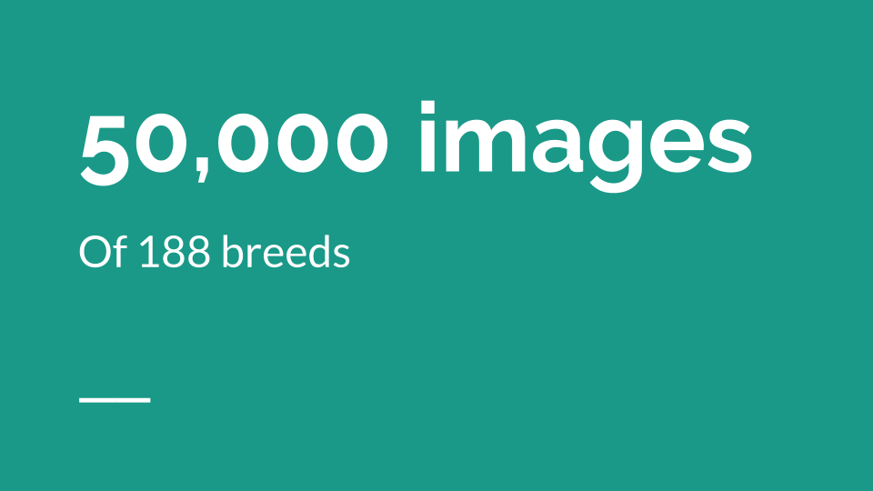
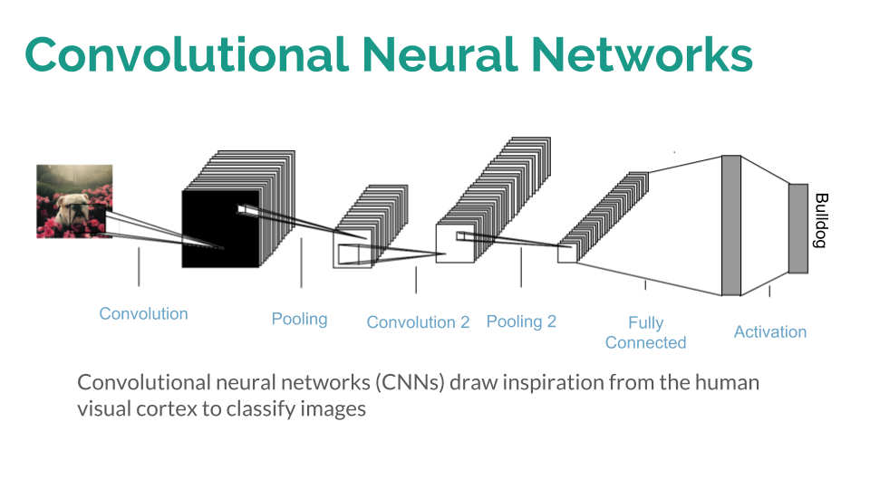
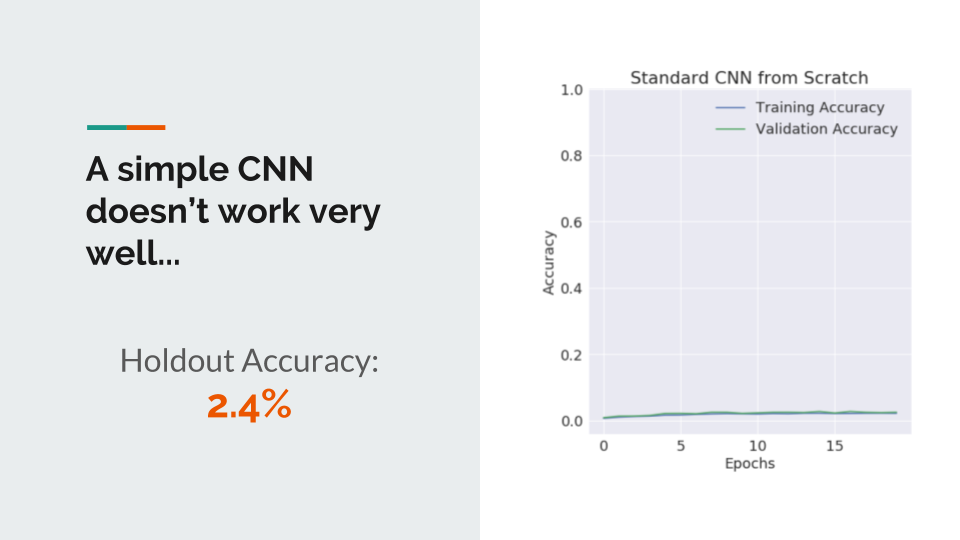
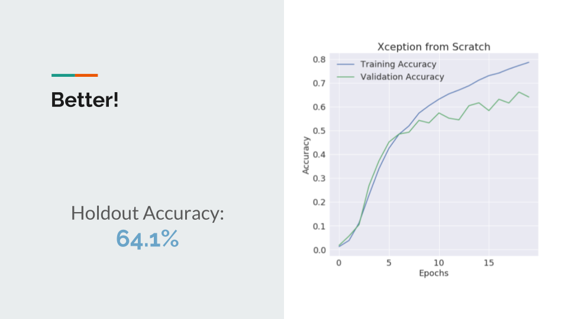
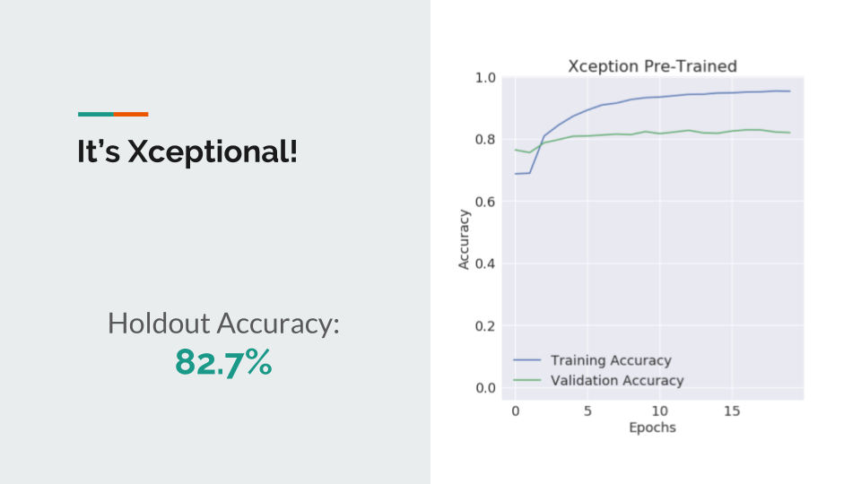
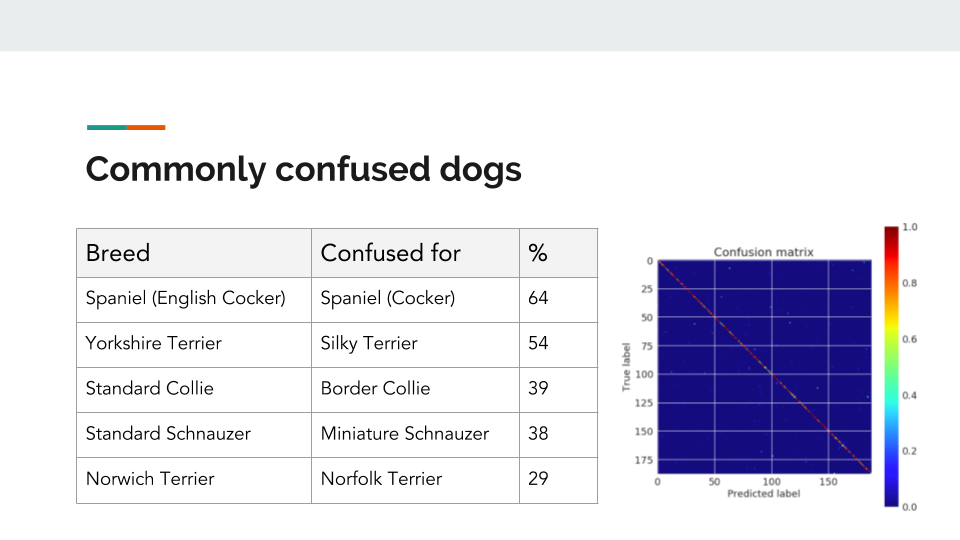

# doggo.name
### Dog breed classifier using deep learning

#### About the project
I love dogs but I can never tell what breed they are.
I also love playing around with neural networks.
I decided to make an app that can tell me what a dog's breed is just by giving it a picture.
If you're confused about the term doggo, here's <a href = "https://www.npr.org/sections/alltechconsidered/2017/04/23/524514526/dogs-are-doggos-an-internet-language-built-around-love-for-the-puppers"> a helpful guide!</a>

#### Data
Every good model needs a good dataset, especially for fine-grain image classification models. Instead of downloading a pre-baked dataset, I decided to gather my own images for a large volume of realistic examples.
I wrote a script that downloaded 400 pictures of each breed from an image search engine; overall I got over 20gb of data.
The data was automatically split into 70% training, 20% validation and 10% holdout.
I saved the images to a google cloud drive disk so I could easily attach it to a powerful deep learning instance later; then took a small prototyping dataset and put it on my personal machine.  

#### Modeling

##### Neural Networks

 Image classification has historically been a difficult task, but modern technologies such as cloud computing and accessible neural network frameworks have make great improvements in the last several years. In particular, Convolutional neural networks (CNNs) have had a huge impact; image classification error in international contests like the ImageNet ILSVRC decreased over 10x from 2010 to 2017, mainly due to advancements in CNNs (Gershgorn, 2017).

 

 A convolutional neural network is loosely based on the human visual cortex (Fukushima, 1988) by hierarchical organization of simple visual features into complex ones. It works by passing inputs through a series of convolutional layers, each with a set of filters that can learn to activate when they pass over a certain feature at a certain position on an image. These feature activations get passed to other convolutional layers deeper in the network, building higher level representations of the image. This architecture has the advantage of being translation invariant, meaning it can recognize features in different spatial arrangements.

 After I tested many different architectures on my personal computer, looking at training and validation performance, I decided to run three main models on the full dataset. I used an Adam optimizer for all three as it has been shown to have high performance in image classification (Kingma & Ba, 2014).

 #### Training
 I set up a Google Cloud Platform instance with a deep learning VM, 16 vCPUs, 4 NVIDIA Tesla P100 GPUs, 104GB of RAM and attached my 40gb SSD with the full dataset on it to the instance. I trained each model for 20 epochs (with image augmentation and categorical cross entropy as the loss function) and saved log files using Tensorboard. I then ran an evaluation on the holdout set to get accuracy, a confusion matrix and a classification report by breed.

 #### Results

 ##### 1. Baseline 12-layer simple CNN with only two convolutional layers.

 

 This model did not work especially well as it only predicted 2.4% of dog photos correctly after 20 epochs. This is likely because there are not enough parameters available to create a complex representation of the image.  
 **Next, I tried using a much deeper model:**

##### 2. Xception (no pre-loaded weights)

 The top performing neural net architecture. Xception has 134 layers with 36 convolutional layers. It takes advantage of depthwise separable convolutions, leading to increased classification accuracy and computational efficiency (Chollet 2017). However, it still only reaches 64.1% accuracy after 20 epochs. We could train it for a long time and might achieve some sort of reasonable accuracy, but there is a shortcut we can take using transfer learning.
 ** Let's try applying a model that has already been trained to recognize images and see if we can 'teach' it to recognize dog breeds.**

 ###### 3. Xception (ImageNet weights)
 

 The top performing neural net, with pre-trained weights from the ImageNet dataset. This is the same architecture as model #2, but we're starting with the weights that it learned from classifying millions of different kinds of images, from cars to people and everything in between! The features that it learned to recognize here will most likely give it a head start in being able to classify dogs. However, we need to do something a little bit differently here; if we use the same learning rate on every layer, it is possible to overfit by overwriting the weights on the more basic features. We want to the model to mostly learn different combinations of features to predict on, not to learn entirely new features. Using the logic detailed by Liu and Wang (2015), I decided to do transfer learning by using an adam optimizer with a 0.1x learning rate on all of the layers except for the softmax activation layer.

 This is really quite good! There's definitely room for improvement, but given my time constraint I saved the model at the lowest loss and used that as my predictor.

 I created a confusion matrix of the holdout predictions, and used that to determine which dog breeds were most commonly confused for each other.

 

 For example, the model confuses English Cocker Spaniels with Standard Cocker Spaniels approximately 64% of the time. This is not surprising to me; given that the breeds look quite similar and most people could not tell the difference either!

#### App
I saved the h5 model file and used it to pass predictions to a flask app, which I then dockerized and deployed to an AWS instance. See <a href = "www.doggo.name">doggo.name</a> for a demo.

#### Future Work

The model accuracy could definitely be increased; Liu and Wang achieved 99% classification accuracy on a more difficult dataset so there is likely room for improvement here, especially given the amount of data. In addition, the model was trained on all pure-bred dogs so it does not predict mixed breeds especially well.

#### References
Chollet, F. (2017). Xception: Deep learning with depthwise separable convolutions. *arXiv preprint*, 1610-02357.

Fukushima, K. (1988). Neocognitron: A hierarchical neural network capable of visual pattern recognition. *Neural networks*, 1(2), 119-130.

Gershgorn, D. (2017). The Data That Transformed AI Research—and Possibly the World. *Quartz, July, 26.*

Kingma, D. P., & Ba, J. (2014). Adam: A method for stochastic optimization. *arXiv preprint arXiv*:1412.6980.

Liu, D., & Wang, Y. (2017). Monza: image classification of vehicle make and model using convolutional neural networks and transfer learning.

#### Acknowledgments

Rune Botten for the <a href="https://gist.github.com/runeb/c11f864cd7ead969a5f0"> Javacript image rotation script </a>

Erik Brorson for his implementation of <a href="https://erikbrorson.github.io/2018/04/30/Adam-with-learning-rate-multipliers/">Adam with learning rate multipliers</a>

Xin Fu for the <a href="https://github.com/mtobeiyf/keras-flask-deploy-webapp">base of the flask app</a>
